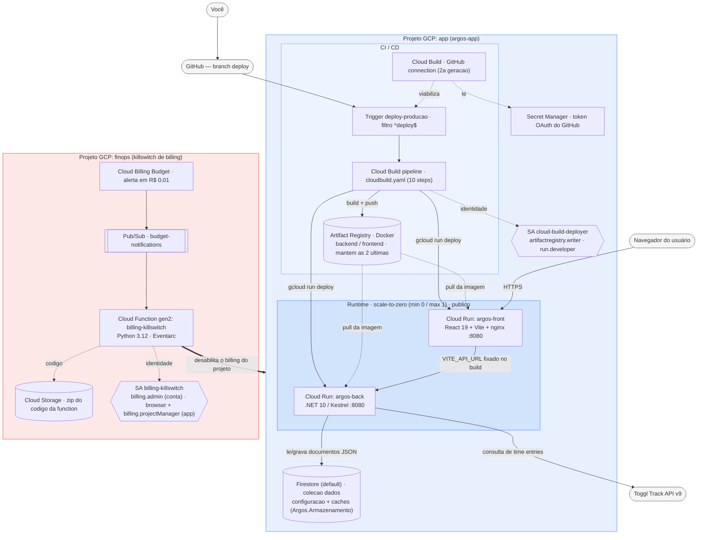

# argos-infra

Infraestrutura de deploy do `argos` no GCP, com premissa de **custo
zero**: Cloud Run (frontend + backend) + Cloud Build (CI/CD) + Artifact
Registry + Firestore (dados do app, dentro da cota gratuita), sem ambiente de
homologação — só a branch `deploy` disparando produção.

## Arquitetura da stack



### O que roda, como e por quê

**Projeto `app` — a aplicação e sua pipeline**

| Componente | Tecnologia | Como está sendo usado | Por quê |
|---|---|---|---|
| **Cloud Run — backend** | .NET 10 / Kestrel, container `:8080` | Serve a Web API (`argos-back`); `min_instance_count=0`, `max_instance_count=1`, público (`allUsers`) | Escala a zero sem tráfego = custo zero na operação normal; teto de 1 instância evita surpresa de conta. Sem auth na infra porque a proteção é opcional no próprio app (HTTP Basic via env var) |
| **Cloud Run — frontend** | React 19 + Vite, servido por nginx, container `:8080` | Serve a SPA (`argos-front`); mesma config de escala e acesso público | SPA estática consumida direto pelo navegador do usuário; a URL do backend (`VITE_API_URL`) é gravada no bundle em *build time*, não em runtime |
| **Artifact Registry** | Repositório Docker (`argos`) | Guarda as imagens `backend:<sha>` e `frontend:<sha>` de cada deploy; Cloud Run puxa a imagem de lá | Duas *cleanup policies* (KEEP + DELETE) mantêm só as 2 versões mais recentes de cada serviço → storage mínimo |
| **Cloud Build — trigger** | `deploy-producao`, regex de branch `^deploy$` | Dispara o pipeline a cada `git push` na branch `deploy` | Não há ambiente de homologação: a branch `deploy` **é** a produção |
| **Cloud Build — pipeline** | `cloudbuild.yaml`, 10 steps | test (`dotnet build` / `npm ci && build && lint`) → build das 2 imagens Docker → push → `gcloud run deploy` dos 2 serviços → health check | `dotnet build`/`tsc` são o "teste" possível (o projeto não tem suíte automatizada); o health check falha o build se algum serviço não responder 2xx pós-deploy |
| **Cloud Build — GitHub connection** | Conexão de 2ª geração, por região | Liga o repositório GitHub ao Cloud Build; o token OAuth fica no Secret Manager | É o mecanismo atual (o GitHub App clássico saiu do Console); criada **manualmente** (OAuth interativo) e adotada no state via `terraform import` |
| **Firestore** | Banco `(default)`, modo Native, na `region` (`firestore.tf`) | Guarda configuração e caches do backend como documentos JSON (coleção `dados`, ver [Firestore](#firestore--armazenamento-de-dados)); o backend acessa com a SA de runtime (`roles/datastore.user`) | Persistência real sem volume nem VM — a pasta `dados/` do container é efêmera; cabe na cota gratuita (1 banco por projeto). `deletion_policy = ABANDON`: `terraform destroy` não apaga os dados |
| **Secret Manager** | — | Armazena o token OAuth da conexão GitHub | Exigência da conexão de 2ª geração; a API é habilitada pelo Terraform mas o segredo em si não é gerenciado por ele |
| **Service Account `cloud-build-deployer`** | IAM Service Account | Identidade do trigger: `artifactregistry.writer` + `run.developer` + `logging.logWriter` + `serviceAccountUser` sobre a SA `argos-runtime` | Menor privilégio para build + push + deploy; `logWriter` é **obrigatório** quando o trigger usa SA customizada |
| **Service Account `argos-runtime`** | IAM Service Account | Identidade de *runtime* dos 2 serviços Cloud Run; recebe `roles/datastore.user` para o backend usar o Firestore | Dedicada porque a SA padrão do Compute Engine só existe com a API do Compute habilitada (que o projeto não usa); o deployer precisa poder "agir como" ela para fazer `gcloud run deploy` |

**Projeto `finops` — o killswitch de orçamento (isolado de propósito, ver seção abaixo)**

| Componente | Tecnologia | Como está sendo usado | Por quê |
|---|---|---|---|
| **Cloud Billing Budget** | Orçamento (criado via `gcloud`, fora do Terraform) | Orçamento de `R$ 0,01` → publica o gasto do mês no tópico Pub/Sub várias vezes por dia | "Avise no primeiro centavo de gasto"; a criação do Budget depende de recursos que só existem após o `apply` e não entrou no escopo de automação |
| **Pub/Sub `budget-notifications`** | Tópico | Único canal entre o Budget e a Function | É o padrão oficial do Google para *"disable billing with notifications"* |
| **Cloud Function `billing-killswitch`** | Python 3.12, gen2, gatilho Eventarc | Notificação com `costAmount > budgetAmount` → desabilita o billing do projeto `app` (`billing_account_name=""`); gasto dentro do orçamento ou mensagem que não é de budget → só registra no log | O Budget publica no tópico **várias vezes por dia**, mesmo abaixo do limite — sem comparar os valores, a primeira notificação de rotina já desligaria o projeto; transforma "conta subindo" em "projeto suspenso" antes de virar fatura alta |
| **Cloud Storage (bucket de source)** | Bucket dedicado | Guarda o `.zip` do código da Function (empacotado pelo provider `archive`) | `google_cloudfunctions2_function` exige `storage_source` em GCS — não aceita código inline nem Git |
| **Eventarc** | — | Entrega as mensagens Pub/Sub → Function gen2 | Obrigatório para *event trigger* de Function gen2 com SA customizada |
| **Service Account `billing-killswitch`** | IAM Service Account | `roles/billing.admin` **na billing account** + `roles/browser` e `roles/billing.projectManager` **no projeto `app`** | Desligar o billing de outro projeto exige permissão nos dois lados: na billing account e no projeto (`resourcemanager.projects.get` para ler o billing, `deleteBillingAssignment` para desvinculá-lo). A function roda no `finops`, então não herda nada do `app` — sem os papéis no projeto, dá 403 |

**Transversal aos dois**

| Componente | Tecnologia | Como está sendo usado | Por quê |
|---|---|---|---|
| **Terraform** | `>= 1.9`, provider `google` (+ `archive` no `finops`) | Duas árvores independentes (`terraform/app/`, `terraform/finops/`), cada uma com seu state | State **local** e gitignored: projeto pessoal, sem colaboração em equipe → não compensa provisionar um bucket GCS só para o state |
| **Dois projetos GCP separados** | — | `finops` provisiona o mecanismo que protege `app` | Se `app` for suspenso por estouro de orçamento, tudo dentro dele para junto — o killswitch precisa viver **fora** para sobreviver à própria ação e permitir religar/diagnosticar |
| **GitHub (`glerystonmatos/argos`)** | Repositório | Fonte do código; push na branch `deploy` dispara o build | Deploy baseado em Git, sem console/upload manual |
| **Toggl Track API v9** | API externa | Consumida pelo backend **em runtime** para buscar os *time entries* | É a fonte de dados da aplicação; o retorno cru fica em cache no Firestore |

> Legenda do diagrama: caixa azul = projeto `app`, caixa vermelha = projeto `finops`. Setas tracejadas = dependência de configuração/identidade; seta grossa = ação do killswitch (desliga o billing do projeto inteiro).

## Duas árvores Terraform, dois projetos GCP, de propósito

```
terraform/
 ├─ finops/   # projeto GCP dedicado só à proteção de billing (killswitch)
 └─ app/      # projeto GCP principal: Cloud Run, Cloud Build, Artifact Registry
```

**Por quê separados**: o mecanismo que protege o orçamento (Pub/Sub + Cloud
Function + Service Account com permissão de administrar billing) não pode
viver no mesmo projeto que ele protege — se o projeto de app for suspenso por
estouro de orçamento (billing desabilitado), tudo dentro dele para junto,
inclusive o killswitch que deveria continuar funcionando. Isolar em dois
projetos GCP garante que o killswitch sobrevive à própria ação que ele
executa.

## Estado do Terraform

Local (`terraform.tfstate`, gitignored) nas duas árvores — projeto pessoal,
sem necessidade de colaboração em equipe; evita provisionar um bucket GCS só
para isso.

## Como o custo fica em zero, na prática

Duas coisas diferentes, não confundir:
- **Cloud Run `min_instance_count=0`/`max_instance_count=1`** (`terraform/app/cloud-run.tf`)
  é o que mantém o custo em zero **na operação normal** — sem tráfego, zero
  instâncias rodando, zero cobrança (dentro do free tier — confirmar limites
  atuais na documentação oficial, não assumidos aqui).
- **O killswitch** (`terraform/finops`) é a rede de segurança para o
  **anormal** — um pico de tráfego, um bug, uma chave vazada sendo abusada.
  Ele não impede que ALGUM custo aconteça antes de agir (ver limitação
  abaixo); ele existe para não deixar um problema virar uma conta alta.
- **Firestore** fica na cota gratuita diária (1 GiB, 50 mil leituras, 20 mil
  escritas) do banco `(default)` — o uso do Argos é ordens de grandeza menor;
  ver [Custo do Firestore](#custo-do-firestore).

---

## Firestore — armazenamento de dados

O `argos-back` guarda configuração e caches como **documentos JSON** no **Firestore** (Firebase) —
persistentes no Cloud Run, onde a pasta `dados/` do container é perdida a cada *cold start*. O código
fica em [`argos-back/Argos.Armazenamento/`](../argos-back/Argos.Armazenamento) (`ArmazenamentoFirestore`, SDK
`Google.Cloud.Firestore`).

O `Argos.Nucleo` define o contrato `IArmazenamentoDados` (síncrono: `Ler`, `Gravar`, `Existe`, `Apagar`, `Listar`) sobre **documentos lógicos** identificados por nome (`TogglUsuarios`, `SprintData_<chave>`...), conteúdo em JSON. Há duas implementações, escolhidas na subida da API (`Program.cs`, registrada no log):

| Implementação | Onde fica | Quando é usada |
|---|---|---|
| `ArmazenamentoFirestore` | `argos-back/Argos.Armazenamento` | `ARMAZENAMENTO__PROJETO_FIRESTORE` preenchida (produção no Cloud Run) |
| `ArmazenamentoArquivos` | `argos-back/Argos.Nucleo/Configuracao` | variável vazia — grava `dados/<Documento>.json` ao lado do executável (dev local, `docker-compose`) |

Os Carregadores do núcleo (`Carregador*`) e as rotas HTTP não mudaram: quem consome continua chamando `Carregar`/`Salvar` e o frontend não sabe onde os dados estão. O `Argos.Nucleo` segue sem `PackageReference` — o SDK do Firestore fica só no `Argos.Armazenamento`.

**Por que Firestore**: persistência real no Cloud Run sem volume nem VM, dentro da cota gratuita (ver [Custo do Firestore](#custo-do-firestore)), com dados legíveis no console (mapas/listas nativos, não texto).

### Criar o banco

O banco é criado pelo Terraform junto com o resto do ambiente (`terraform/app/firestore.tf`, [etapa 5](#5-infraestrutura-da-aplicação-terraformapp)), no **mesmo projeto GCP** do Cloud Run. Ele habilita `firestore.googleapis.com`, cria o banco `(default)` em modo **Native** na `region` do projeto (`deletion_policy = ABANDON`: `terraform destroy` não apaga os dados) e dá `roles/datastore.user` à conta que roda o Cloud Run.

Só para criar à mão (outro projeto, testes fora do Terraform):

1. Console Firebase → **Adicionar projeto** → escolha o projeto GCP existente (ou crie um).
2. **Firestore Database** → **Criar banco de dados** → modo **Native**, ID `(default)`, local próximo da API (ex.: `us-central1`).
3. Regras de segurança: pode deixar "modo de produção" (tudo negado) — o backend acessa via SDK de servidor com IAM, que ignora as regras do Firebase.

> Use sempre o banco `(default)`: a cota gratuita vale para **um único banco por projeto**.

### Credenciais e emulador

O SDK usa **Application Default Credentials** — nenhuma chave vai no código nem no repositório.

- **Cloud Run**: automático, pela conta de serviço do serviço (`roles/datastore.user` via Terraform).
- **Máquina local**, com o seu usuário Google:

```bash
gcloud auth application-default login
```

- **Máquina local/Docker com conta de serviço**: aponte `GOOGLE_APPLICATION_CREDENTIALS` para o `.json` da chave. Nomes `credenciais-firebase*.json` e `*-sa.json` já estão no `.gitignore`/`.dockerignore` — trate o arquivo como segredo.

**Emulador** (testes sem tocar em dados reais): com `FIRESTORE_EMULATOR_HOST` definida, o SDK conecta no emulador, sem credencial. Sobe com Docker, sem instalar o gcloud:

```bash
docker run -d --rm --name argos-firestore-emu -p 8085:8085 gcr.io/google.com/cloudsdktool/google-cloud-cli:emulators gcloud emulators firestore start --host-port=0.0.0.0:8085
```

Depois rode a API com `ARMAZENAMENTO__PROJETO_FIRESTORE=argos-teste` e `FIRESTORE_EMULATOR_HOST=localhost:8085` (no Docker, `host.docker.internal:8085`).

### Variáveis de ambiente do armazenamento

| Variável | Obrigatória | Efeito |
|---|---|---|
| `ARMAZENAMENTO__PROJETO_FIRESTORE` | não | ID do projeto GCP do Firestore. Vazia = arquivos `.json` em `dados/` |
| `GOOGLE_APPLICATION_CREDENTIALS` | não | Caminho do `.json` de conta de serviço (fora do Cloud Run, se não usar `gcloud auth application-default login`) |
| `FIRESTORE_EMULATOR_HOST` | não | `host:porta` do emulador; tem precedência sobre produção |
| `CHAVE_CRIPTOGRAFIA` | recomendada | A mesma de sempre: os tokens continuam gravados com `enc:` dentro do JSON |

No Cloud Run, configure junto das demais (ver [Cloud Run](#cloud-run--frontend-e-backend)):

```bash
gcloud run services update argos-back --region=us-central1 --project=SEU_PROJETO_APP_ID --update-env-vars=ARMAZENAMENTO__PROJETO_FIRESTORE=SEU_PROJETO_APP_ID
```

### Estrutura de dados

Banco `(default)` → coleção raiz **`dados`** → um documento por nome lógico. Campos em camelCase (como a API); itens de nome livre (status, colunas, pessoas) ficam em **listas de objetos**, não chaves de mapa — nomes como `PAUSADO/IMPEDIDO` não são ID válido no Firestore.

| Documento | JSON |
|---|---|
| `TogglUsuarios` | `{usuarios:[{chave,nomeExibicao,tokenApi:"enc:…",sigla,cor,selecionado,administrador}]}` |
| `TogglConfiguracao` | `{agrupamento,corTag}` |
| `TogglTags` | `{tags:[{nome,categorias:["Dev"],detalhar}]}` |
| `RelatorioParametros`, `GantParametros` | `{dataInicio,dataFim}` (`yyyy-MM-dd`) |
| `Sprints` | `{sprints:[{chave,nome,horasPorDia,margemPercentual,dataInicio,dataFim,diasNaoUteis,horasDeduzidas:{<chaveToggl>:horas},fechado}]}` |
| `JiraConexao` | `{urlDominio,email,apiToken:"enc:…",quadroDevId,quadroDevNome,quadroAnaliseId,quadroAnaliseNome}` |
| `JiraCampos` | `{campos:[{tipo,id,nome}],janelaAlertaPrevisaoLiberacaoDias}` |
| `JiraStatus` | `{status:[{nome,cor,responsaveis:[],final}]}` |
| `JiraPrioridades`, `JiraColunasDev`, `JiraColunasAnalise`, `JiraTimes` | `{itens:[{nome,cor}]}` |
| `JiraEpicos` | `{itens:[{chave,cor}]}` |
| `JiraQuadro` | `{colunasOcultasDev:[],colunasOcultasAnalise:[]}` |
| `JiraTogglMapeamento` | `{usuarios:[{displayName,chaveToggl?,sigla?,cor?}]}` |
| `TogglTagsCache` | `{tags:[],atualizadoEm}` |
| `JiraStatusCache`, `JiraPrioridadesCache`, `JiraUsuariosCache` | `{nomes:[],atualizadoEm}` |
| `JiraColunasDevCache`, `JiraColunasAnaliseCache` | `{quadroId,nomes:[],atualizadoEm}` (descartado se o quadro configurado mudar) |
| `JiraQuadrosCache` | `{quadros:[{id,nome,projeto}],atualizadoEm}` |
| `RelatorioData`, `GantData`, `SprintData_<chave>` | cache cru do Toggl: `{dataInicio,dataFim,usuarios:[{chave,nomeExibicao,tokenApi,registros:[…]}]}` (registros no formato da API do Toggl, snake_case) |
| `JiraSprintData_<chave>` | `{issues:[…]}` |
| `JiraPlanejamentoGlobalDev`, `JiraPlanejamentoGlobalAnalise` | `{quadroId,quadroNome,atualizadoEm,sprintJira,colunas,cartoes,kanban}` (global, independente do sprint do app) |

**Migração de formato**: ao subir e logo após "Importar" (Dados), a API converte documentos e campos de formatos antigos para os atuais — lê o antigo, grava o novo e **apaga o antigo**, para não deixar órfãos no Firestore (`MigracaoDados`, idempotente; falha só vai para o log). Hoje: `JiraConexao.quadroId/quadroNome` → `quadroDev*`, `JiraQuadro.colunasOcultas` → `colunasOcultasDev`, `JiraColunas` → `JiraColunasDev`, `JiraColunasCache` apagado, `JiraPlanejamentoData_<chave>` → o mais recente vira `JiraPlanejamentoGlobalDev` e os demais são apagados, sprint sem `margemPercentual` recebe 30.

**Caches do Toggl divididos**: um documento do Firestore tem no máximo **1 MiB**, e esses caches crescem com o período e o número de usuários. No Firestore o documento principal guarda só `{dataInicio,dataFim,usuarios:[chaves]}`; cada usuário vai para a subcoleção `usuarios/{chave}` e os registros para `blocos/{0000,0001…}`, até 1.000 por bloco. `Ler` remonta o JSON completo; `Gravar` substitui tudo; `Apagar` remove as subcoleções (o Firestore não apaga em cascata). No `.zip` de download cada documento vem **inteiro**, num `.json` só.

Números: inteiros viram inteiros do Firestore; decimais viram `double` (os valores vêm de campos numéricos do Jira/usuário, que o `double` representa sem perda).

### Custo do Firestore

Firestore **Standard**, cota gratuita diária (reinicia à meia-noite do Pacífico), igual nos planos Spark e Blaze — o Blaze (já exigido pelo Cloud Run) só cobra o que passar dela:

| Recurso | Cota gratuita | Uso típico do Argos |
|---|---|---|
| Armazenamento | 1 GiB | ~1 MB (todos os documentos) |
| Leituras | 50 mil/dia | dezenas por tela; um download completo lê algumas centenas |
| Escritas | 20 mil/dia | poucas por consulta; uma restauração completa grava algumas centenas |
| Exclusões | 20 mil/dia | só ao apagar sprint/regravar cache |
| Saída de rede | 10 GiB/mês | desprezível (tráfego entre Cloud Run e Firestore na mesma região) |

A cota vale só para **um banco por projeto** — o `(default)`. O killswitch de billing (`argos-infra/terraform/finops`) continua sendo a rede de segurança para uso anormal. Confira os limites atuais em [Firebase Pricing](https://firebase.google.com/pricing).

### Limitações do armazenamento

- **Síncrono por cima de assíncrono**: o contrato é síncrono (como os antigos Carregadores) e o SDK é assíncrono — o adaptador bloqueia a thread da requisição (`GetAwaiter().GetResult()`). Sem risco de deadlock no ASP.NET Core; aceitável para uso de um usuário.
- **Sem transação entre documentos**: salvar algo que grava mais de um documento (ex.: conexão + campos do Jira) não é atômico — igual aos antigos arquivos. O lock de `JiraStatus` é por processo, suficiente com o Cloud Run em no máximo 1 instância.
- **Falhas do Firestore** chegam aos endpoints como `IOException` → 500 com mensagem (`TratamentoIo`), como as falhas de disco antes.
- Um usuário com mais de ~1 MiB de metadados fora dos registros (não acontece na prática) ainda esbarraria no limite de documento.


## Criar o ambiente — passo a passo

Roteiro completo, do zero até a aplicação no ar. Cada passo é **um comando**;
rode na ordem, sem pular. Os comandos estão escritos para o **PowerShell**
(Windows); comandos longos quebram linha com a crase (`` ` ``) no fim — em
bash, troque a crase por `\`.

### Antes de começar — o que você vai precisar

Os comandos usam os marcadores abaixo; troque pelos seus valores **em todos
os comandos** em que aparecerem.

| Marcador / informação | O que é | Onde conseguir |
|---|---|---|
| `SEU_PROJETO_FINOPS_ID` | ID do projeto GCP do killswitch | **Você escolhe** (passo 2.2). 6–30 caracteres, minúsculas, dígitos e hífen, começando com letra, **único no GCP inteiro** — ex.: `argos-finops-<sufixo>` |
| `SEU_PROJETO_APP_ID` | ID do projeto GCP da aplicação | **Você escolhe** (passo 2.3), mesmas regras — ex.: `argos-app-<sufixo>` |
| `SEU_BILLING_ACCOUNT_ID` | Conta de faturamento (`XXXXXX-XXXXXX-XXXXXX`) | Passo 2.1 (`gcloud billing accounts list`) ou Console GCP → **Faturamento** → *Gerenciar contas de faturamento*. Se não tiver nenhuma, crie por lá (pede cartão; o custo esperado continua R$ 0) |
| Dono e nome do repositório GitHub | `GlerystonMatos` / `argos` (defaults de `terraform/app/variables.tf`) | URL do repositório: `github.com/<dono>/<nome>` |
| `SUA_CHAVE` (`CHAVE_CRIPTOGRAFIA`) | Chave que criptografa os tokens do Toggl/Jira | Arquivo `.env` na raiz do repositório (modelo em `.env.example`). Precisa ser **a mesma** usada para gravar os dados que você vai importar — com outra chave os tokens `enc:` não são lidos |
| `SEU_USUARIO` / `SUA_SENHA` | Login da tela de entrada (HTTP Basic) | **Você escolhe** (o `.env` local pode ter os mesmos `AUTH__USUARIO`/`AUTH__SENHA`) |
| Região | `us-central1` | Default das duas árvores Terraform; se mudar, mude em todos os comandos |

Também é preciso ter uma conta Google com permissão de **administrador da
conta de faturamento** (o `terraform apply` do finops concede um papel nela)
e o `git` instalado, com acesso de push ao repositório.

### 1. Ferramentas

#### 1.1 Instalar o Terraform

```powershell
winget install HashiCorp.Terraform
```
Instala o Terraform (as duas árvores exigem `>= 1.9.0`). Feche e reabra o
terminal depois — senão o comando não é encontrado no `PATH`.

#### 1.2 Conferir o Terraform

```powershell
terraform -version
```
Deve mostrar `Terraform v1.9` ou mais novo.

#### 1.3 Instalar o Google Cloud CLI

```powershell
winget install Google.CloudSDK
```
Instala o `gcloud`. Feche e reabra o terminal depois. Se o `winget` falhar,
use o instalador gráfico oficial:
<https://dl.google.com/dl/cloudsdk/channels/rapid/GoogleCloudSDKInstaller.exe>
(já configura o `PATH`).

#### 1.4 Conferir o gcloud

```powershell
gcloud --version
```
Deve listar `Google Cloud SDK` e os componentes instalados.

#### 1.5 Autenticar o gcloud

```powershell
gcloud auth login
```
Abre o navegador para login com a sua conta Google. Autentica o **CLI**
(`gcloud ...` usado nos passos manuais deste roteiro).

#### 1.6 Autenticar o Terraform

```powershell
gcloud auth application-default login
```
Outro login, independente do anterior: grava as *Application Default
Credentials*, que é o que o provider `google` do Terraform usa. Sem ele, o
`terraform plan` falha com erro de credencial.

### 2. Projetos GCP e faturamento

#### 2.1 Descobrir a conta de faturamento

```powershell
gcloud billing accounts list
```
Anote o `ACCOUNT_ID` (formato `XXXXXX-XXXXXX-XXXXXX`) da conta com
`OPEN = True` — é o `SEU_BILLING_ACCOUNT_ID` de todo o roteiro. Lista vazia =
você ainda não tem conta de faturamento (crie no Console → Faturamento) ou
sua conta Google não tem acesso a ela.

#### 2.2 Criar o projeto do killswitch

```powershell
gcloud projects create SEU_PROJETO_FINOPS_ID --name="Argos FinOps"
```
Cria o projeto que vai guardar só a proteção de orçamento. O Terraform não
cria projetos (nenhum `google_project` declarado) — eles são pré-requisito.
Se o ID já estiver em uso no GCP, o comando falha: escolha outro.

#### 2.3 Criar o projeto da aplicação

```powershell
gcloud projects create SEU_PROJETO_APP_ID --name="Argos"
```
Cria o projeto onde ficam Cloud Run, Cloud Build, Artifact Registry e
Firestore.

#### 2.4 Conferir os IDs

```powershell
gcloud projects list
```
Confira que os dois aparecem na coluna `PROJECT_ID` exatamente como você
digitou. O `--name` é só o nome de exibição; tudo daqui em diante usa o
**ID**.

#### 2.5 Vincular o faturamento ao projeto do killswitch

```powershell
gcloud billing projects link SEU_PROJETO_FINOPS_ID --billing-account=SEU_BILLING_ACCOUNT_ID
```
Criar o projeto não vincula faturamento sozinho, e sem ele nenhuma API
(nem as gratuitas) pode ser habilitada.

#### 2.6 Vincular o faturamento ao projeto da aplicação

```powershell
gcloud billing projects link SEU_PROJETO_APP_ID --billing-account=SEU_BILLING_ACCOUNT_ID
```
Mesma conta de faturamento nos dois projetos.

#### 2.7 Conferir o vínculo

```powershell
gcloud billing projects describe SEU_PROJETO_APP_ID
```
Deve mostrar `billingEnabled: true`. Repita com `SEU_PROJETO_FINOPS_ID` se
quiser conferir o outro.

### 3. Killswitch de orçamento (`terraform/finops`)

Vem **antes** da aplicação para que a proteção já exista quando o primeiro
recurso pago for criado.

#### 3.1 Entrar na árvore do finops

```powershell
cd argos-infra\terraform\finops
```
A partir da raiz do repositório. Todo `terraform` desta etapa roda daqui —
cada árvore tem seu próprio state, e rodar no diretório errado aplica os
recursos errados.

#### 3.2 Criar o arquivo de variáveis

```powershell
cp terraform.tfvars.example terraform.tfvars
```
O Terraform lê `terraform.tfvars` automaticamente, e ele está no
`.gitignore` — os valores reais não vão para o repositório.

#### 3.3 Preencher as variáveis

```powershell
notepad terraform.tfvars
```
Preencha os três valores obrigatórios e salve:

- **`finops_project_id`** — o ID do passo 2.2.
- **`app_project_id`** — o ID do passo 2.3.
- **`billing_account_id`** — o `ACCOUNT_ID` do passo 2.1.

Os opcionais (`region`, `function_name`, `notification_topic_name`) já têm
default — deixe comentados.

#### 3.4 Inicializar o Terraform

```powershell
terraform init
```
Baixa os providers (`google` e `archive`) e prepara a pasta `.terraform`.
Não cria nada na nuvem.

#### 3.5 Revisar o plano

```powershell
terraform plan
```
Mostra o que **seria** criado, sem criar nada. Espere: as APIs do projeto,
o bucket com o `.zip` do código da function, o tópico Pub/Sub
`budget-notifications`, a service account `billing-killswitch`, os bindings
de IAM (inclusive `roles/billing.admin` **na conta de faturamento** e
`roles/browser`/`roles/billing.projectManager` **no projeto da aplicação**) e a
Cloud Function `billing-killswitch`. Nada deve aparecer para ser destruído.

#### 3.6 Aplicar

```powershell
terraform apply
```
Cria de fato os recursos do plano — responda `yes`. Leva alguns minutos (a
Function é compilada pelo Cloud Build do próprio projeto). Erro de permissão
no binding da conta de faturamento = sua conta Google não é administradora
dela.

#### 3.7 Testar o killswitch

```powershell
gcloud pubsub topics publish budget-notifications --project=SEU_PROJETO_FINOPS_ID --message='{\"costAmount\": 1.0, \"budgetAmount\": 0.01}'
```
Publica no tópico uma notificação falsa de budget com gasto (`costAmount`)
acima do orçamento (`budgetAmount`) — a Function **desliga o faturamento do
projeto da aplicação**. As barras antes das aspas são necessárias no
PowerShell 5.1 (sem elas as aspas internas somem e o JSON chega inválido);
em bash, use `'{"costAmount": 1.0, "budgetAmount": 0.01}'`. Uma mensagem com
`costAmount` menor ou igual ao `budgetAmount`, ou que não seja JSON, só é
registrada no log, sem desligar nada. Este é o melhor momento para testar: o
projeto da aplicação ainda está vazio, então não há nada no ar para
derrubar.

#### 3.8 Ver o log da Function

```powershell
gcloud functions logs read billing-killswitch --gen2 --region=us-central1 --project=SEU_PROJETO_FINOPS_ID --limit=20
```
Espere ~1 minuto depois do passo anterior. O esperado é
`Gasto 1.0 acima do orçamento 0.01: billing desabilitado em ...`
(`Mensagem ignorada` = o JSON chegou quebrado; confira as aspas do 3.7). Um `403 The caller does not have permission`
em `get_project_billing_info` significa que faltam os papéis da SA **no
projeto da aplicação** (`roles/browser` e `roles/billing.projectManager`,
em `service_account.tf`): rode `terraform apply` de novo no finops, espere
~1 minuto (a propagação de IAM não é instantânea) e repita o passo 3.7.

#### 3.9 Confirmar que o faturamento caiu

```powershell
gcloud billing projects describe SEU_PROJETO_APP_ID
```
Deve mostrar `billingEnabled: false` — prova de que o killswitch funciona.

#### 3.10 Religar o faturamento

```powershell
gcloud billing projects link SEU_PROJETO_APP_ID --billing-account=SEU_BILLING_ACCOUNT_ID
```
Mesmo comando do passo 2.6 — é o inverso exato do que a Function faz.
Confira de novo com o passo 3.9 (`billingEnabled: true`) antes de seguir.

#### 3.11 Criar o orçamento (Budget)

```powershell
gcloud billing budgets create `
  --billing-account=SEU_BILLING_ACCOUNT_ID `
  --display-name="argos-killswitch" `
  --budget-amount=0.01BRL `
  --threshold-rule=percent=1.0 `
  --filter-projects=projects/SEU_PROJETO_APP_ID `
  --notifications-rule-pubsub-topic=projects/SEU_PROJETO_FINOPS_ID/topics/budget-notifications
```
Cria o alerta que alimenta o killswitch — fica fora do Terraform e vive na
conta de faturamento, não no projeto. Orçamento de `0.01` = "desligue no
primeiro centavo de gasto" (o mais perto de zero que o mecanismo aceita). O
`--threshold-rule` só controla os e-mails de alerta: o Pub/Sub recebe o gasto
do mês **várias vezes por dia**, mesmo abaixo do limite, e é a Function que
compara `costAmount` com `budgetAmount` antes de agir.
Detalhes:

- A **moeda** precisa ser a da conta de faturamento — se ela for em dólar,
  use `0.01USD` (confira em Console → Faturamento → *Visão geral da conta*).
- O nome do tópico é o `terraform output budget_notification_topic` do
  finops.
- Se o `gcloud` pedir para habilitar `billingbudgets.googleapis.com`,
  responda `y`.

**Limitação que não se contorna por configuração**: o Google documenta um
atraso entre o gasto acontecer e a notificação chegar — o killswitch pode
agir depois de já existir algum custo (normalmente pequeno). Não é garantia
matemática de R$ 0,00.

#### 3.12 Conferir o orçamento

```powershell
gcloud billing budgets list --billing-account=SEU_BILLING_ACCOUNT_ID
```
O budget `argos-killswitch` deve aparecer com o tópico Pub/Sub associado.
Anote o `name` (termina com o `BUDGET_ID`) — usado para editar ou apagar o
budget no futuro.

### 4. Conexão do GitHub com o Cloud Build (manual)

O Cloud Build usa a conexão de **2ª geração** (por região), que exige
autorização OAuth interativa no GitHub — por isso é manual, e o Terraform só
a adota depois (passo 5.5).

#### 4.1 Habilitar as APIs necessárias

```powershell
gcloud services enable cloudbuild.googleapis.com secretmanager.googleapis.com --project=SEU_PROJETO_APP_ID
```
A conexão guarda o token OAuth do GitHub no Secret Manager, e o `terraform
apply` (que também habilita essas APIs) ainda não rodou. Espere 2–3 minutos
antes do próximo passo — a habilitação não é instantânea.

#### 4.2 Criar a conexão

```powershell
gcloud builds connections create github github-connection --region=us-central1 --project=SEU_PROJETO_APP_ID
```
Cria a conexão (ainda pendente) e mostra uma **URL** no terminal. Abra-a no
navegador, entre no GitHub, autorize o **Google Cloud Build** e, quando
pedir, instale o app na sua conta dando acesso ao repositório `argos`.
`github-connection` é o nome que o Terraform espera
(`github_connection_name` em `variables.tf`) — se usar outro, ajuste a
variável no passo 5.3.

Se o comando falhar com erro de permissão no Secret Manager, dê o papel ao
agente do Cloud Build e rode o 4.2 de novo. Primeiro descubra o número do
projeto:

```powershell
gcloud projects describe SEU_PROJETO_APP_ID --format="value(projectNumber)"
```
Depois conceda o papel (troque `NUMERO_DO_PROJETO` pelo valor acima):

```powershell
gcloud projects add-iam-policy-binding SEU_PROJETO_APP_ID --member="serviceAccount:service-NUMERO_DO_PROJETO@gcp-sa-cloudbuild.iam.gserviceaccount.com" --role="roles/secretmanager.admin"
```

#### 4.3 Confirmar a autorização

```powershell
gcloud builds connections describe github-connection --region=us-central1 --project=SEU_PROJETO_APP_ID
```
Procure `installationState.stage: COMPLETE`. Outro valor = a autorização não
terminou; a própria saída traz a URL/ação pendente (normalmente concluir a
instalação do app no GitHub).

### 5. Infraestrutura da aplicação (`terraform/app`)

#### 5.1 Entrar na árvore da aplicação

```powershell
cd ..\app
```
A partir de `argos-infra\terraform\finops` (da raiz do repositório:
`cd argos-infra\terraform\app`). State separado do finops.

#### 5.2 Criar o arquivo de variáveis

```powershell
cp terraform.tfvars.example terraform.tfvars
```
Mesma ideia do passo 3.2 (arquivo gitignored).

#### 5.3 Preencher as variáveis

```powershell
notepad terraform.tfvars
```
Só **`app_project_id`** é obrigatório — o ID do passo 2.3. Os demais já têm
default; descomente só se precisar mudar:

- `github_owner`/`github_repo` — dono e nome do repositório (da URL
  `github.com/<dono>/<nome>`); defaults `GlerystonMatos`/`argos`.
- `github_connection_name` — precisa bater com o nome do passo 4.2.
- `region` — se mudar, use a mesma região em todos os comandos.

#### 5.4 Inicializar o Terraform

```powershell
terraform init
```
Baixa o provider `google`. Não cria nada na nuvem.

#### 5.5 Adotar a conexão do GitHub

```powershell
terraform import google_cloudbuildv2_connection.github projects/SEU_PROJETO_APP_ID/locations/us-central1/connections/github-connection
```
Coloca no state a conexão criada à mão na etapa 4. **Obrigatório antes do
`apply`**: sem isso o Terraform tenta criar uma conexão que já existe e
falha (`Error 400: invalid argument: one of github_config...`). Roda uma vez
só; depois, o `lifecycle.ignore_changes` de `cloud-build.tf` impede o
Terraform de mexer na autorização.

#### 5.6 Revisar o plano

```powershell
terraform plan
```
Espere: as APIs, o repositório `argos` do Artifact Registry (com as 2
cleanup policies), a service account `cloud-build-deployer` com 4 bindings,
a SA de runtime `argos-runtime` com `roles/datastore.user`, o banco Firestore `(default)`, os
2 serviços Cloud Run `argos-front`/`argos-back` (ainda com a imagem de
exemplo do Google) + acesso público, o repositório do Cloud Build e o
trigger `deploy-producao`. A conexão importada **não** deve aparecer para
ser criada.

#### 5.7 Aplicar

```powershell
terraform apply
```
Cria os recursos — responda `yes`. Os serviços passam a responder com a
imagem de exemplo do Google até o primeiro deploy (etapa 6).

#### 5.8 Anotar as URLs

```powershell
terraform output
```
Mostra `backend_url` e `frontend_url` (endereços `https://...run.app`) —
usados na validação. Pode rodar de novo a qualquer momento nesta pasta.

### 6. Configuração do backend e primeiro deploy

#### 6.1 Configurar as variáveis de ambiente do backend

```powershell
gcloud run services update argos-back --region=us-central1 --project=SEU_PROJETO_APP_ID `
  --update-env-vars=ARMAZENAMENTO__PROJETO_FIRESTORE=SEU_PROJETO_APP_ID,CHAVE_CRIPTOGRAFIA=SUA_CHAVE,AUTH__USUARIO=SEU_USUARIO,AUTH__SENHA=SUA_SENHA
```
Cria uma revisão nova só com as variáveis; o deploy da pipeline troca a
imagem e **mantém** as variáveis. Cada uma:

- `ARMAZENAMENTO__PROJETO_FIRESTORE` — liga o Firestore (sem ela a API grava
  na pasta efêmera do container e perde tudo a cada *cold start*).
- `CHAVE_CRIPTOGRAFIA` — a do `.env` local (ver tabela do início).
- `AUTH__USUARIO`/`AUTH__SENHA` — ligam o login; sem os dois, a API fica
  aberta para qualquer um com a URL.

Se algum valor tiver vírgula, use outro separador:
`--update-env-vars=^;^CHAVE=a,b;OUTRA=c` (sintaxe de escape do `gcloud`).

> ⚠️ Essas variáveis não estão no Terraform. Antes de qualquer `terraform
> apply` futuro em `terraform/app`, confira no `plan` se ele quer remover o
> `env` do `argos-back`; se quiser, rode este passo de novo logo depois do
> `apply`.

#### 6.2 Disparar o primeiro deploy

```powershell
git push origin main:deploy
```
Envia a `main` para a branch `deploy` do GitHub (cria a branch se não
existir) — o trigger dispara na hora e roda o `cloudbuild.yaml` completo:
build/"teste" do back e do front, imagens com a tag do commit, push, deploy
dos 2 serviços e health check. Se o push for recusado (*non-fast-forward*),
a `deploy` remota tem commits que a `main` não tem — resolva isso antes,
nunca com `--force` às cegas. Daqui em diante, **todo push na `deploy` é um
deploy de produção**.

#### 6.3 Acompanhar o build

```powershell
gcloud builds list --region=us-central1 --project=SEU_PROJETO_APP_ID --limit=5
```
O build mais recente deve ir de `WORKING` para `SUCCESS` (leva alguns
minutos). O trigger é regional — sem `--region` a lista vem vazia. No
Console: Cloud Build → Histórico (selecione a região).

#### 6.4 Ver o log de um build (se falhar)

```powershell
gcloud builds log BUILD_ID --region=us-central1 --project=SEU_PROJETO_APP_ID
```
`BUILD_ID` é a coluna `ID` do passo anterior. Mostra a saída de cada um dos
10 steps.

#### 6.5 Testar o backend

```powershell
curl.exe https://URL_DO_BACKEND/health
```
`URL_DO_BACKEND` = `backend_url` do passo 5.8. Deve responder `Healthy`. No
PowerShell 5.1 use `curl.exe` — `curl` sozinho é apelido do
`Invoke-WebRequest`.

#### 6.6 Conferir o armazenamento

```powershell
gcloud run services logs read argos-back --region=us-central1 --project=SEU_PROJETO_APP_ID --limit=50
```
Procure `Armazenamento de dados: Firestore (projeto ...)`. Se aparecer o
armazenamento em arquivos, a variável do passo 6.1 não pegou.

#### 6.7 Importar os dados

Abra o `frontend_url` (passo 5.8) no navegador, entre com o usuário/senha do
passo 6.1 e vá em **Dados** → importar. O `.zip` vem de outra instalação
(tela **Dados** → baixar) ou é um zip dos `.json` da pasta `dados/` local.
Sem nenhum usuário do Toggl cadastrado, a própria tela abre o diálogo de
importação no primeiro acesso.

Depois, rode o [checklist de validação](#checklist-de-validação-pós-deploy)
abaixo.

---

## Checklist de validação pós-deploy

- [ ] Build no Cloud Build terminou **verde** (todos os 10 steps, incluindo
      `health-check`) — se `health-check` falhar, o deploy já aconteceu mas
      algo está errado; não assuma que "build vermelho" = "nada mudou".
- [ ] `curl.exe https://<url-do-backend>/health` retorna `Healthy`.
- [ ] Logs do `argos-back` mostram `Armazenamento de dados: Firestore (projeto ...)`
      e, depois de importar, a tela Dados → Baixar traz os documentos `.json`.
- [ ] Abrir a URL do frontend no navegador — o "Resumo da aplicação" (página inicial) carrega, sem
      erro de CORS/conexão no console do navegador (confirma que o
      `VITE_API_URL` foi gravado com a URL certa do backend).
- [ ] `gcloud artifacts repositories list --project=SEU_PROJETO_APP_ID` mostra
      o repositório `argos` (colunas `REPOSITORY` e `LOCATION`; o caminho das
      imagens é `LOCATION-docker.pkg.dev/PROJECT-ID/REPOSITORY-ID`).
- [ ] `gcloud artifacts docker images list <repo>` mostra só as 2 imagens
      mais recentes de cada serviço, um dia após o segundo deploy (a
      cleanup policy roda em background, não é instantânea).
- [ ] Depois de alguns minutos sem tráfego, o painel do Cloud Run no Console
      (aba *Métricas* → *Contagem de instâncias de contêiner*) confirma 0
      instâncias ativas (scale-to-zero de verdade).
- [ ] O budget do passo 3.11 aparece no Console de Billing com o tópico
      Pub/Sub certo associado.

---

## Rollback (repointar revisão, sem rebuild)

```powershell
gcloud run revisions list --service=argos-back --region=us-central1 --project=SEU_PROJETO_APP_ID
```

```powershell
gcloud run revisions list --service=argos-front --region=us-central1 --project=SEU_PROJETO_APP_ID
```
Lista as revisões existentes de cada serviço (cada deploy bem-sucedido cria
uma nova, mesmo sem tráfego apontado pra ela).

```powershell
gcloud run services update-traffic argos-back --region=us-central1 --project=SEU_PROJETO_APP_ID --to-revisions=REVISION_ANTIGA=100
```

```powershell
gcloud run services update-traffic argos-front --region=us-central1 --project=SEU_PROJETO_APP_ID --to-revisions=REVISION_ANTIGA=100
```
Redireciona 100% do tráfego para uma revisão anterior especificada — **sem
rebuildar nada**, a imagem antiga continua no Artifact Registry (respeitando
a cleanup policy de manter as últimas 2). Reversível: rodar de novo apontando
para a revisão mais nova volta ao estado atual.

---

## Recuperação depois do killswitch desligar o billing

Quando o billing é desabilitado, os serviços do projeto de app (Cloud Run,
Cloud Build, Artifact Registry) param de responder — mas **não são
apagados** (o projeto entra num estado suspenso, não é destruído).

1. **Antes de religar, descubra a causa** — Console GCP (com o projeto
   **finops**, que continua funcionando normalmente) → Billing → Reports, ou
   Cloud Logging do projeto de app (histórico de logs de antes do corte
   costuma continuar acessível). Religar sem entender o motivo só adia o
   próximo desligamento.
2. **Religar o billing**:
   ```powershell
   gcloud billing projects link SEU_PROJETO_APP_ID --billing-account=SEU_BILLING_ACCOUNT_ID
   ```
   Mesmo comando do passo 2.6 — é a ação inversa exata do que a Cloud
   Function do killswitch faz.
3. **Confirmar que os serviços voltaram**:
   ```powershell
   curl.exe https://<url-do-backend>/health
   ```
   Cloud Run não precisa de redeploy — a mesma revisão volta a responder
   assim que o billing está ativo de novo.
4. **Sobre o alerta rearmar sozinho**: o comportamento exato de rearme do
   mesmo Budget dentro do mesmo ciclo mensal não foi confirmado — **confira
   na documentação oficial atual** antes de assumir que ele vai (ou não)
   disparar de novo automaticamente se o gasto continuar subindo pelo mesmo
   motivo.

---

## Referência operacional — comandos do dia a dia

Tudo abaixo é **de sua responsabilidade rodar** — nenhum tem efeito colateral
destrutivo por padrão, exceto onde marcado. Região assumida: `us-central1`;
troque se você definiu outra.

### Cloud Run — frontend e backend

```powershell
gcloud run services list --project=SEU_PROJETO_APP_ID --region=us-central1
```
Lista os 2 serviços, com URL e status.

```powershell
gcloud run services describe argos-back --region=us-central1 --project=SEU_PROJETO_APP_ID
```
Detalhe completo de um serviço — imagem atual, tráfego por revisão, env vars,
limites de CPU/memória, URL.

```powershell
gcloud run services logs read argos-back --region=us-central1 --project=SEU_PROJETO_APP_ID --limit=50
```
Últimas 50 linhas de log do backend (troque o nome para o frontend). Use
`--log-filter` para filtrar por severidade se precisar.

```powershell
gcloud run revisions list --service=argos-back --region=us-central1 --project=SEU_PROJETO_APP_ID
```
Histórico de revisões (cada deploy gera uma) — base do rollback, já coberto
na seção acima.

```powershell
gcloud run services update argos-back --region=us-central1 --project=SEU_PROJETO_APP_ID --update-env-vars=CHAVE=valor
```
Muda/acrescenta uma variável de ambiente **sem** rebuildar/redeployar a
imagem — cria uma nova revisão só com a env var alterada (use
`--update-env-vars`, não `--set-env-vars`, que apaga as demais). As
variáveis do backend estão no passo 6.1; `AUTH__USUARIO`/`AUTH__SENHA` são
opcionais (sem os dois, a API fica sem login — ver `CLAUDE.md` §3). Trocar
`CHAVE_CRIPTOGRAFIA` invalida os tokens `enc:` já gravados no Firestore —
reinsira-os depois.

```powershell
gcloud run services update argos-back --region=us-central1 --project=SEU_PROJETO_APP_ID --min-instances=1
```
Força pelo menos 1 instância sempre ativa (elimina *cold start*, por
exemplo para uma demonstração ao vivo) — **sai do "custo zero"** enquanto
estiver assim; volte para `--min-instances=0` depois. Não há start/stop
automático para isso, é manual.

```powershell
gcloud run services delete argos-back --region=us-central1 --project=SEU_PROJETO_APP_ID
```
**Destrutivo** — apaga o serviço (fora do controle do Terraform depois
disso; ele recriaria no próximo `apply`, mas perde histórico de revisões e
as variáveis de ambiente).

### Cloud Build — pipeline

O trigger é **regional** — todo comando de build/trigger precisa de
`--region`.

```powershell
gcloud builds list --region=us-central1 --project=SEU_PROJETO_APP_ID --limit=10
```
Histórico dos últimos builds, com status (`SUCCESS`/`FAILURE`/`WORKING`).

```powershell
gcloud builds log BUILD_ID --region=us-central1 --project=SEU_PROJETO_APP_ID
```
Log completo de um build específico (pegue o `BUILD_ID` do comando acima).

```powershell
gcloud builds triggers run deploy-producao --region=us-central1 --project=SEU_PROJETO_APP_ID --branch=deploy
```
Dispara o pipeline manualmente, sem precisar de um `git push` novo — útil
para re-rodar um deploy que falhou por motivo transitório (ex.: rate limit
de alguma API), sem commit vazio.

```powershell
gcloud builds triggers list --region=us-central1 --project=SEU_PROJETO_APP_ID
```

```powershell
gcloud builds triggers describe deploy-producao --region=us-central1 --project=SEU_PROJETO_APP_ID
```
Lista/detalha o trigger — confirma branch, substitutions, service account
configurados.

**Pausar o trigger temporariamente** (parar de responder a push sem
apagá-lo): mais simples via Console GCP → Cloud Build → Triggers →
alternar o toggle "Enabled" (`gcloud builds triggers update --help` mostra
as opções atuais do CLI).

```powershell
gcloud builds cancel BUILD_ID --region=us-central1 --project=SEU_PROJETO_APP_ID
```
Cancela um build em andamento.

### Artifact Registry — imagens

```powershell
gcloud artifacts docker images list us-central1-docker.pkg.dev/SEU_PROJETO_APP_ID/argos --include-tags
```
Lista todas as imagens/tags nos dois "diretórios" (`backend`, `frontend`) do
repositório.

```powershell
gcloud artifacts repositories describe argos --project=SEU_PROJETO_APP_ID --location=us-central1
```
Detalhe do repositório, incluindo a cleanup policy aplicada (as duas
definidas em `artifact-registry.tf`).

```powershell
gcloud artifacts docker images delete us-central1-docker.pkg.dev/SEU_PROJETO_APP_ID/argos/backend:SHA_ANTIGO --project=SEU_PROJETO_APP_ID
```
Apaga uma imagem/tag específica manualmente — normalmente desnecessário (a
cleanup policy já mantém só as 2 mais recentes), útil se quiser limpar antes
do job de limpeza rodar.

### Billing, Budget e killswitch

```powershell
gcloud billing projects describe SEU_PROJETO_APP_ID
```
Mostra se o billing está `billingEnabled: true` ou `false` no momento —
primeiro comando a rodar se suspeitar que o killswitch disparou.

```powershell
gcloud billing budgets list --billing-account=SEU_BILLING_ACCOUNT_ID
```

```powershell
gcloud billing budgets describe BUDGET_ID --billing-account=SEU_BILLING_ACCOUNT_ID
```
Lista/detalha o(s) budget(s) — confirma valor, threshold e tópico Pub/Sub
associado. `BUDGET_ID` é o final do `name` mostrado pelo `list`.

```powershell
gcloud billing budgets update BUDGET_ID --billing-account=SEU_BILLING_ACCOUNT_ID --budget-amount=NOVO_VALOR
```
Ajusta o valor do orçamento depois de criado, sem recriar o budget.

**Testar o killswitch de novo**: passos 3.7 a 3.10 — o teste **desliga o
billing do projeto da aplicação** (derruba o app no ar), então rode sabendo
que vai religar em seguida.

```powershell
gcloud functions logs read billing-killswitch --gen2 --region=us-central1 --project=SEU_PROJETO_FINOPS_ID --limit=20
```
Log da execução da function — confirma se rodou, se deu erro de permissão
(sinal de que os papéis de Eventarc/IAM do `terraform/finops` precisam de
ajuste), se ignorou a mensagem (`dentro do orçamento`) ou se desligou o
billing (`... billing desabilitado em ...`).

### IAM e service accounts

```powershell
gcloud iam service-accounts list --project=SEU_PROJETO_APP_ID
```

```powershell
gcloud projects get-iam-policy SEU_PROJETO_APP_ID
```
Lista as SAs do projeto e a política de IAM completa — útil para auditar se
alguma permissão além das que o Terraform declarou foi adicionada por fora.

### Terraform

```powershell
terraform output
```
Mostra os valores de saída já aplicados (URLs dos serviços, nome do tópico,
e-mails das SAs) sem precisar consultar o Console.

```powershell
terraform state list
```
Lista todos os recursos que o Terraform está gerenciando naquela árvore —
útil para confirmar que nada foi criado/alterado por fora dele (drift).

```powershell
terraform plan -destroy
```
Mostra o que **seria** destruído, sem destruir nada — prévia segura antes de
um eventual `terraform destroy` (roteiro completo na seção abaixo).

---

## Remover tudo (desmontar o ambiente)

Para o dia em que quiser apagar o Argos do GCP por completo. **Tudo aqui é
destrutivo** e a ordem importa: a aplicação sai primeiro, com o killswitch
ainda protegendo o faturamento. **Não apague os `terraform.tfstate` nem
edite os `terraform.tfvars` antes do fim** — o state é o que diz ao
Terraform o que existe.

#### R.1 Fazer backup dos dados

No frontend, vá em **Dados** → baixar. O `.zip` tem todos os documentos
(usuários, configurações, sprints, caches) e pode ser importado numa
instalação local ou num ambiente novo. Depois do passo R.11 não há como
recuperar.

#### R.2 Entrar na árvore da aplicação

```powershell
cd argos-infra\terraform\app
```
A partir da raiz do repositório.

#### R.3 Revisar o que será destruído

```powershell
terraform plan -destroy
```
Deve listar os 2 serviços Cloud Run (+ acesso público), o repositório do
Artifact Registry (com as imagens), a conexão/repositório/trigger do Cloud
Build, a SA `cloud-build-deployer` com seus bindings, o binding do Firestore
e o banco `(default)`. O banco sai do state mas **os dados ficam**
(`deletion_policy = ABANDON`) até o projeto ser apagado (R.10).

#### R.4 Destruir a aplicação

```powershell
terraform destroy
```
Responda `yes`. Remove serviços, imagens, trigger e a conexão com o GitHub.
As APIs continuam habilitadas (`disable_on_destroy = false`) — somem junto
com o projeto.

#### R.5 Descobrir o ID do orçamento

```powershell
gcloud billing budgets list --billing-account=SEU_BILLING_ACCOUNT_ID
```
Localize o `argos-killswitch` e copie o final do `name`
(`billingAccounts/.../budgets/BUDGET_ID`).

#### R.6 Apagar o orçamento

```powershell
gcloud billing budgets delete BUDGET_ID --billing-account=SEU_BILLING_ACCOUNT_ID
```
O budget foi criado à mão (passo 3.11) e vive na conta de faturamento, não
no projeto — sem este passo ele fica órfão, apontando para um tópico que
deixa de existir.

#### R.7 Entrar na árvore do finops

```powershell
cd ..\finops
```

#### R.8 Revisar o que será destruído

```powershell
terraform plan -destroy
```
Deve listar a Cloud Function, o tópico Pub/Sub, o bucket (+ zip) do código,
a SA `billing-killswitch`, o binding dela **na conta de faturamento** e os
dois bindings no projeto da aplicação.

#### R.9 Destruir o killswitch

```powershell
terraform destroy
```
Responda `yes`. **Obrigatório**, não opcional: o `roles/billing.admin` da SA
fica na conta de faturamento e **não** some apagando o projeto.

#### R.10 Apagar o projeto da aplicação

```powershell
gcloud projects delete SEU_PROJETO_APP_ID
```
Confirme com `Y`. Leva junto o que o Terraform nunca gerenciou: os dados do
Firestore, o segredo do token do GitHub no Secret Manager, os buckets
automáticos do Cloud Build.

#### R.11 Apagar o projeto do killswitch

```powershell
gcloud projects delete SEU_PROJETO_FINOPS_ID
```
Confirme com `Y`. Os dois projetos ficam **30 dias** em "pendente de
exclusão" — dá para voltar atrás com `gcloud projects undelete ID` nesse
prazo; depois some de vez. Um ID de projeto apagado **nunca mais pode ser
reutilizado**: recriar o ambiente exige IDs novos.

#### R.12 Conferir

```powershell
gcloud projects list --filter="lifecycleState:DELETE_REQUESTED"
```
Os dois projetos devem aparecer aqui, marcados como pendentes de
exclusão. Rode também o passo R.5 — o budget não deve
aparecer.

#### R.13 Apagar o state local do finops

```powershell
Remove-Item terraform.tfstate, terraform.tfstate.backup, .terraform -Recurse -Force
```
Ainda em `argos-infra\terraform\finops`. Descrevem um ambiente que não
existe mais; se ficarem, o próximo `apply` tentaria mexer em recursos
apagados. Se algum arquivo não existir, o comando só avisa.

#### R.14 Apagar o state local da aplicação

```powershell
Remove-Item ..\app\terraform.tfstate, ..\app\terraform.tfstate.backup, ..\app\.terraform -Recurse -Force
```
Mesmo motivo, na árvore `app`. Os `terraform.tfvars` podem ficar (têm os
IDs antigos — troque se um dia recriar).

#### R.15 Apagar a branch `deploy` (opcional)

```powershell
git push origin --delete deploy
```
Sem o trigger ela não dispara mais nada; apagar só evita confusão.

#### R.16 Revogar o acesso do Cloud Build no GitHub

No GitHub: **Settings** → **Applications** → aba *Installed GitHub Apps* →
**Google Cloud Build** → *Configure* → **Uninstall**. Remove o acesso que
o passo 4.2 concedeu ao repositório.

#### R.17 Remover as credenciais locais (opcional)

```powershell
gcloud auth application-default revoke
```
Apaga as credenciais do Terraform (passo 1.6) desta máquina. Para sair
também do CLI: `gcloud auth revoke`.
